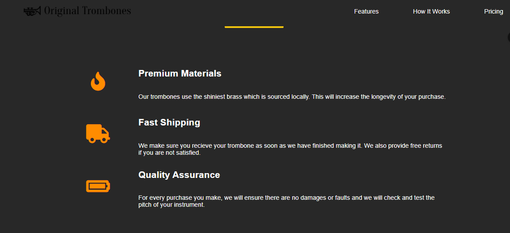

# build-a-product-landing-page

**App desarrollada en este tutorial https://www.freecodecamp.org/espanol/learn/2022/responsive-web-design/build-a-product-landing-page-project/build-a-product-landing-page**
||
Tecnologías:
- HTML
- CSS

